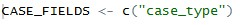
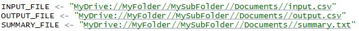
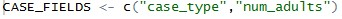

# Spells Creation Demonstration Guide

The R script [calculate_spells.R](https://github.com/chapinhall/FSSDC/blob/master/create_spells/R/calculate_spells.R) converts point in time data to spells.

## Dependencies
Running this code requiers the following libraries:

- `dplyr`

- `data.table`

- `doParallel`

Follow the instructions in the [tutorials](../tutorials/introduction_to_using_r.md) 
section to install these libraries.

## Description of Files

#### The R File

The `calculate_spells.R` file is the code file written in R to
transform monthly extracts of case information into a spells format more
suited for longitudinal analysis. A spell represents a period of time
when the characteristics of a case remain the same. At a minimum, a
spell can be defined as the period for when a case is active, but other
case characteristics may be optionally considered, such as if a case
changes case type or the size of the household changes.

#### Input File

For the demonstration, we provide an input file of mock monthly extracts
called [input.csv](https://github.com/chapinhall/FSSDC/tree/master/create_spells/R/test_data) (in the test_data
directory). It has the following basic format which should
match the format of the file you are preparing  for analysis:

  |**caseid** |  **date**  | **benefits** | **case_type** | **num_adults** |
  |-----------| -----------| -------------|---------------|----------------|
  |1          | 1/1/2016   |    1         |  child only   |      0         |
  |1          | 2/1/2016   |    1         |  child only   |      0         |
  |1          | 3/1/2016   |    1         |  child only   |      0         |
  |1          | 4/1/2016   |    1         |  one parent   |      1         | 
  |1          | 5/1/2016   |    1         |  one parent   |      1         |
  |1          | 6/1/2016   |    1         |  one parent   |      1         |
  |1          | 7/1/2016   |    0         |  one parent   |      1         |
  |1          | 8/1/2016   |    0         |  one parent   |      1         |
  |1          | 9/1/2016   |    0         |  one parent   |      1         |
  |1          | 10/1/2016  |    0         |  one parent   |      1         |
  |1          | 11/1/2016  |    0         |  one parent   |      1         |
  |1          | 12/1/2016  |    0         |  one parent   |      1         |

Fields include unique case id, the date of the extract time period (usually
one record per month), and a flag indicating if the case was receiving
benefits for that time period (1 for receiving or 0 for not receiving). These
fields should be labeled: *"caseid"*, *"date"*, and *"benefits"* respectively.
Optionally, there can be additional fields that are used to define spells. The
example above, and the sample input file, are examples of TANF data with two
additional fields, case_type and num_adults.  The first additional field,
case_type, defines the type of the TANF case, child only, one parent or two
parent. The second additonal field, num_adults, is the number of adults on a
case. The section on customizing code below explains how to work with
additional fields for defining spells.  The field names are not case
sensitive, so they may be capitalized or lower case. All fields can be either
numeric or character.  Explicitly recording inactive cases in the monthly
extract input file is optional, as missing months will be inferred as inactive
and used to calculate

#### Output File

The output file is created once the R file is run with the input file.
It contains the spells created by the code. Additional fields such as
*"case_type"* or *"num_adults"* will be added to the output file if they
are added to the CASE_FIELDS code parameter. For details on the
CASE_FIELDS code parameter, see the "Customizing the Code for Your
Data" section of this guide. The output file will have this structure:

  |**caseid** | **benefits** | **startMonth** | **endMonth** | **spellLength** |
  |-----------| -------------| ---------------| -------------| ----------------|
  |1          | 1            | 01/2016        | 06/2016      | 6               |
  |1          | 0            | 07/2016        | 12/2016      | 6               |

The spells above refers to the monthly records in the input file above.

#### Summary File

The summary file is created once the R file is run with the input file.
It contains summary information on the spells such as the number of
spells and the average length of the spells for active and inactive
cases.

## How to Run the Code

Before running the code, you will need to install the programs listed in
the Installation Guide document. Open the R file “calculate\_spells.R”
in Rstudio. There are a few code parameters that you will need to change
before the code can run.

1.  INPUT_FILE (character): This code parameter stores the filepath
    where your input file containing case information is stored. It must
    be a .csv file type.

2.  OUTPUT_FILE (character): This code parameter stores the filepath
    where you want the spells to be saved once calculated. It must be a
    .csv file type.

3.  SUMMARY_FILE (character): This code parameter stores the filepath
    where you want the summary file to be saved once statistics on the
    spells are available. It must be a .txt file type.

  **NOTE**: Windows users will need to format your filepaths differently
  in R. A Windows filepath looks like
  "C:/Folder1/Subfolder/MyFile.csv". In R, the filepath would need to look
  like "C://Folder1//Subfolder//MyFile.csv".

Changing those 3 code parameters, is enough to run the code with its
default code parameters for CHURN and CASE\_FIELDS. However, you may
wish to change these two code parameters depending on your specific
data. This is described in the next section.

## Customizing the Code for Your Data 

There are two optional code parameters you can change in the code
depending on your needs:

1.  CHURN (integer): The CHURN code parameter allows states to define
    how long (in months) to wait for a case to be inactive before
    considering it closed and creating a new spell. Your state may wish
    to customize the length of a service gap to ignore as administrative
    churn when defining spells. Administrative churn refers to a short
    temporary stop in service for administrative reasons rather than a
    longer term change in case eligibility. The default length is 0
    months meaning any service gap is considered a new spell. Setting it
    to 1 means ignore service gaps of 1 month or shorter when
    creating spells. Setting to 2 means ignore all service gaps 2 months
    or shorter when creating spells, etc.

2.  CASE_FIELDS (character vector): The CASE_FIELDS code parameter
    allows states to add additional fields other than benefits status to
    detect changes in when defining spells. States may wish for spells
    to be based on other case characteristics in addition to whether the
    case is receiving benefits. For example, an agency may wish to create
    spells if a case stops receiving benefits, if the case changes case
    type, or if the number of adults in the household changes. Add the
    field names representing these fields in your input file to the
    CASE_FIELDS code parameter. For example, the CASE_FIELDS code
    parameter may look like this

    

## Examples of How to Run the Code

The sample input file provided for this demonstration contains 3 unique
cases with two years of case history. The number of spells created in
the output file depend on how the agency wishes to define spells. There
are two code parameters within the “calculate_spells.R” file that can
change the number of spells outputted: the CHURN code parameter and the
CASE_FIELDS code parameter.

1.  Save the “calculate_spells.R” and the “input.csv” files provided in
    this tutorial somewhere accessible to where you have installed R.

2.  Change the INPUT_FILE and OUPUT_FILE code parameters to the
    filepaths where you have saved the files in step 1. Set the
    SUMMARY\_FILE code parameter to the filepath where you want the
    summary file to be saved. Your code may look like this:

    

    *Notice how the folders are separated by two backslashes instead of one backslash. That is how R reads Window's filepaths. If you are working on a Mac or Linux operating system you need to use a forward slash instead of the double backslashes. For more information on R filepaths see [this explanation](https://kb.iu.edu/d/azzp) from Indiana University.*

3.  Run the code in RStudio. From the top navigation bar select
    Code &gt; Run Region &gt; Run All.

4.  Examine the output file. The code ran with the default values for
    the code parameters CHURN and CASE_FIELDS. Any gap in benefits receipt
    will be considered a new spell, and the code will only look at the
    “benefits” column when doing change detection for spells. Your output
    file should match below. Caseid 1 has 12 spells. If you look at the
    input.csv file for caseid 1, you will notice that it starts active
    and changes status every 2 months for 2 years.

    | **caseid** | **benefits** | **startMonth** | **endMonth** | **spellLength**|
    |------------|--------------|----------------|--------------| ---------------|
    | 1          | 1            | 01/2016        | 02/2016      | 2              |
    | 1          | 0            | 03/2016        | 04/2016      | 2              |
    | 1          | 1            | 05/2016        | 06/2016      | 2              |
    | 1          | 0            | 07/2016        | 08/2016      | 2              |
    | 1          | 1            | 09/2016        | 10/2016      | 2              |
    | 1          | 0            | 11/2016        | 12/2016      | 2              |
    | 1          | 1            | 01/2017        | 02/2017      | 2              |
    | 1          | 0            | 03/2017        | 04/2017      | 2              |
    | 1          | 1            | 05/2017        | 06/2017      | 2              |
    | 1          | 0            | 07/2017        | 08/2017      | 2              |
    | 1          | 1            | 09/2017        | 10/2017      | 2              |
    | 1          | 0            | 11/2017        | 12/2017      | 2              |
    | 2          | 1            | 01/2016        | 12/2017      | 24             |
    | 3          | 1            | 01/2016        | 12/2017      | 24             |

5.  Examine the summary file. It should say there are 8 active spells
    and 6 inactive spells as well as some other descriptive statistics
    about the spells. This matches the output file results.

## Changing the CHURN Code Parameter

1.  In the R code, change the CHURN code parameter value from 0 to 2. If
    the CHURN code parameter is less than 2, caseid 1 will have 12
    distinct spells. If we changed the CHURN code parameter to 1, the
    code would ignore 1 month service gaps when creating spells. In this
    example, that will not affect the output since all of the gaps are
    2 months.

2.  Save the changes to your R code (Ctrl + S or the Save button
    in RStudio). Rerun the code as we did previously.

3.  Examine the output file. Caseid 1 now has significantly
    fewer spells. The short two month service gaps were assumed to be
    administrative churn and were joined to the active spell for
    caseid 1. Notice that the last two months remain an inactive spell
    even though they too represent a 2 month gap. Because the last
    months of the study period for this case are inactive, it is assumed
    the case will remain inactive beyond the study period, and therefore
    the inactive spell remains.

    |**caseid** | **benefits** | **startMonth** | **endMonth** | **spellLength** |
    |-----------| -------------| ---------------| -------------| ----------------|
    |1          | 1            | 01/2016        | 10/2017      | 22              |
    |1          | 0            | 11/2017        | 12/2017      | 2               |
    |2          | 1            | 01/2016        | 12/2017      | 24              |
    |3          | 1            | 01/2016        | 12/2017      | 24              |

4.  Examine the summary file. It should say there are 3 active spells
    and 1 inactive spells as well as some other descriptive statistics
    about the spells. This matches the output file results.

## Tracking Case Type with the CASE_FIELDS Code Parameter

1.  In the R code, change the CASE_FIELDS code parameter to look
    like this.

    

2.  Save the changes to your R code (Ctrl + S or the Save button
    in RStudio). Rerun the code as we did previously.

3.  Examine the output file. Notice that the field `case_type` which
    was not previously in the output file is now included because we
    have included it in the CASE_FIELDS code parameter. Caseid 2 starts
    as a "child only" case_type and changes every 2 months creating a
    total of 12 spells for caseid 2 which previously only had 1 spell.
    The output for caseid 2 should now look like this:

    |**caseid** | **benefits** | **case_type** | **startMonth** | **endMonth** | **spellLength** |
    |-----------| -------------| --------------| ---------------| -------------| ----------------|
    |2          | 1            | child only    | 01/2016        | 02/2016      | 2               |
    |2          | 1            | one parent    | 03/2016        | 04/2016      | 2               |
    |2          | 1            | child only    | 05/2016        | 06/2016      | 2               |
    |2          | 1            | one parent    | 07/2016        | 08/2016      | 2               |
    |2          | 1            | child only    | 09/2016        | 10/2016      | 2               |
    |2          | 1            | one parent    | 11/2016        | 12/2016      | 2               |
    |2          | 1            | child only    | 01/2017        | 02/2017      | 2               |
    |2          | 1            | one parent    | 03/2017        | 04/2017      | 2               |
    |2          | 1            | child only    | 05/2017        | 06/2017      | 2               |
    |2          | 1            | one parent    | 07/2017        | 08/2017      | 2               |
    |2          | 1            | child only    | 09/2017        | 10/2017      | 2               |
    |2          | 1            | one parent    | 11/2017        | 12/2017      | 2               |

1.  Examine the summary file. Its results will be different than before.
    Its exact results will vary depending on how you have the CHURN code
    parameter set now.

## Tracking Case Type and Number of Adults with the CASE_FIELDS Code Parameter

1.  In the R code, change the CASE_FIELDS code parameter to look
    like this. 

    Now the code looks for changes in either field when creating spells.

2.  Save the changes to your R code (Ctrl + S or the Save button

3.  Examine the output file. The field `num_adults` is now included in
    the output file in addition to `case_type` because we have included
    it in the CASE_FIELDS code parameter. Caseid 3 changes
    `num_adults` every 2 months creating 12 total spells. The output
    for caseid 3 should now look like this:

    |**caseid** | **benefits** | **case_type** | **num_adults** | **startMonth** |**endMonth** | **spellLength** |
    |-----------| ------------ | --------------| ---------------| ---------------| ------------| ----------------|
    |3          | 1            | one parent    | 1              | 01/2016        | 02/2016     | 2               |
    |3          | 1            | two parent    | 2              | 03/2016        | 04/2016     | 2               |
    |3          | 1            | one parent    | 1              | 05/2016        | 06/2016     | 2               |
    |3          | 1            | two parent    | 2              | 07/2016        | 08/2016     | 2               |
    |3          | 1            | one parent    | 1              | 09/2016        | 10/2016     | 2               |
    |3          | 1            | two parent    | 2              | 11/2016        | 12/2016     | 2               |
    |3          | 1            | one parent    | 1              | 01/2017        | 02/2017     | 2               |
    |3          | 1            | two parent    | 2              | 03/2017        | 04/2017     | 2               |
    |3          | 1            | one parent    | 1              | 05/2017        | 06/2017     | 2               |
    |3          | 1            | two parent    | 2              | 07/2017        | 08/2017     | 2               |
    |3          | 1            | one parent    | 1              | 09/2017        | 10/2017     | 2               |
    |3          | 1            | two parent    | 2              | 11/2017        | 12/2017     | 2               |

4.  Examine the summary file. Its results will be different than before.
    Its exact results will vary depending on how you have the CHURN code
    parameter set now.

There are 3 caseids included in the sample input for 2 years of case
history. Using the examples presented here, the amount of spells
outputted can range from 4 spells to 36 spells depending on how you set
the code parameters within the `calculate_spells.R` code.
