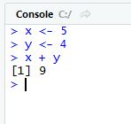
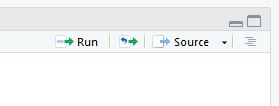

# Installation Guide for R 

This document contains instructions for installing R and RStudio, the software used to run some of the code in this repository. R is a free, open source, programming language often used for data manipulation, analysis, and visualization. RStudio is a development environment that makes using R easier. You may need to work with your IT team to have these programs installed in a place that can access your data.

## Installing R and RStudio

1. Install R: R is available from [The Comprehensive R Archive Network](https://cran.r-project.org/) (CRAN). Click the download button for your operating system (Linux, Mac, or Windows). 

2. Install RStudio: You can download RStudio from the [RStudio website](https://www.rstudio.com/products/rstudio/download/). Select the RStudio Desktop Open Source option. 

## Using R and RStudio

In RStudio, you will see a panel labeled "Console". You can type and run R commands here. 

You can also run R commands that are stored in a file by opening the file (File -> Open File) and clicking "Run" in the upper right.

## Installing additional packages

You may want to intall aditional packages that can do a variety of tasks beyond what is available in base R. Packages for R and made available through [CRAN](https://cran.r-project.org/). The R code in this repository includes instructions for installing the required packages. You can also browse avaialable packages [here](https://cran.r-project.org/web/packages/).  To install a package use the command `install.packages`. For example, to install [dpylr](https://dplyr.tidyverse.org/), a popular package of data manipulation tools, type `install.packages("dplyr)`.

## Further information

The instructions above are designed to help you run the code available in this repository. There are a many tutorials available for R. We recommend the following:

